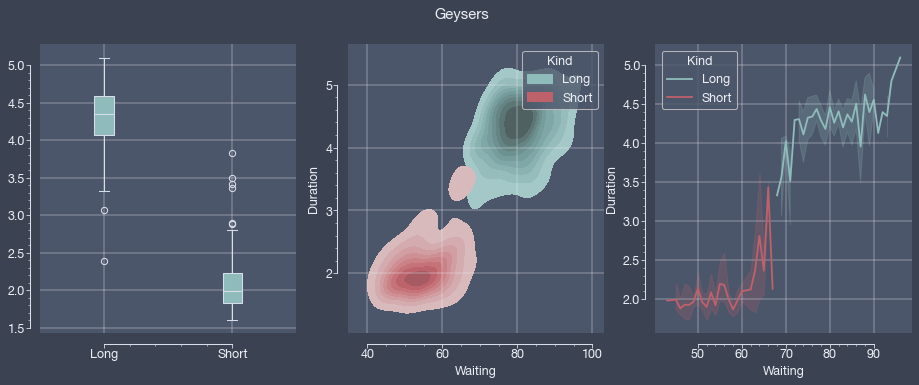

# Aquarel 🎨 

Aquarel is a lightweight templating engine and wrapper around Matplotlibs' `rcparams` to make styling plots simple.
Aquarel templates can be defined programmatically and be serialized and shared in a JSON format.

## Usage
Styles can be either applied globally

```python
from aquarel import load_theme

load_theme("arctic_light").apply()

# ... plotting code here
```
...or with a context manager:
```python
from aquarel import load_theme

with load_theme("arctic_light"):
    # ... plotting code here
```

Besides loading a predefined theme, you can create a new theme
```python
from aquarel import Theme

theme = (
    Theme(name="demo", description="A demo theme.")
    .set_grid(draw=True, width=0.5)
    .set_font(family="monospace")
    .set_color(grid_color="blue")
)
```
...modify an existing one
```python
from aquarel import load_theme

theme = (
    load_theme("arctic_light")
    .set_grid(width=2)
)
```
...and write and load your custom styles to and from disk:
```python
from aquarel import Theme

theme = Theme.from_file("custom.json")
theme.save("custom.json")
```

If the simplified API of aquarel is not sufficient for your use-case, you can also directly modify the underlying `rcparams` with overrides:
```python
from aquarel import load_theme

theme = load_theme("arctic_light").set_overrides({
    "ytick.minor.visible": False,
    "xtick.minor.visible": True
})
```

## Themes
| Name           | Description                    | Preview                      |
|:---------------|:-------------------------------|:-----------------------------|
| `arctic_dark`  | Dark theme with frosty colors  |   |
| `arctic_light` | Light theme with frosty colors |  |
